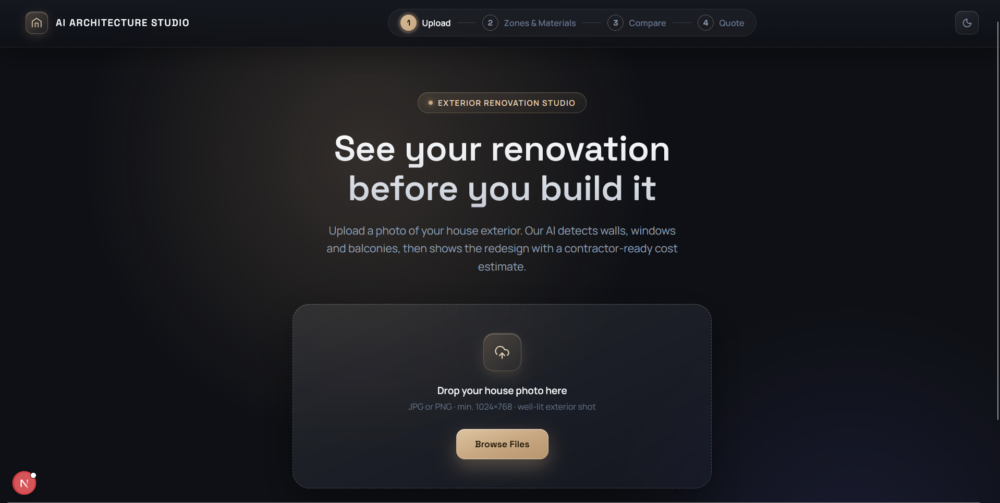
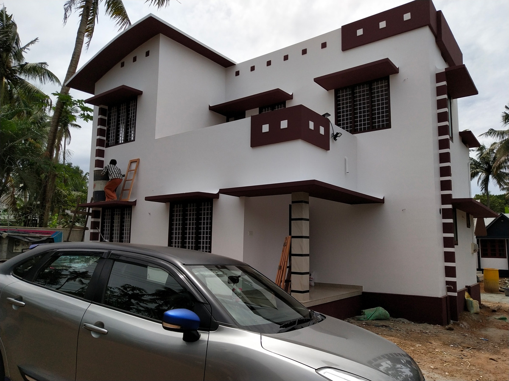
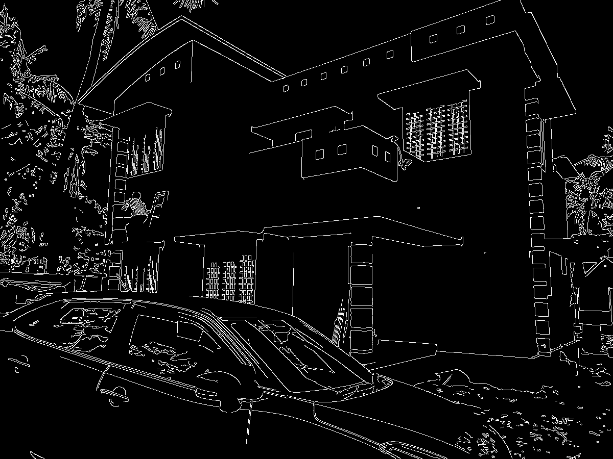
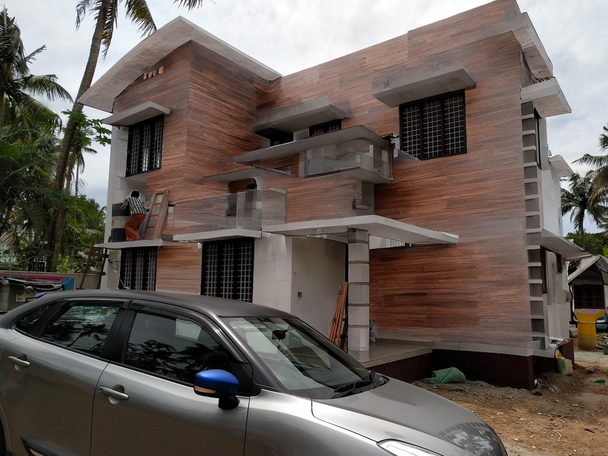
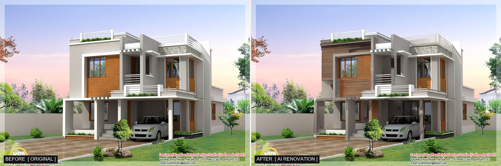

# AI-Based Exterior House Renovation & Cost Estimation System



## Models Used

- **[Meta SAM 3](https://ai.meta.com/sam3/)** (Segment Anything Model 3) — segments the uploaded house photo into individual architectural zones: walls, windows, balconies, pillars, railings, roof parapet, and gate.
- **Stable Diffusion (Inpainting)** — generates the new material texture, painted only within the unlocked (renovatable) mask region for each zone.
- **ControlNet (Canny edge guidance)** — extracts a structural edge map from the original photo and conditions the diffusion model on it, so the render keeps the house's true geometry instead of drifting from it, while a strict pixel-lock guarantees protected regions (windows, doors, sky, vehicles, people) are pasted back from the original photo untouched — a 100% mathematical guarantee, not a soft constraint.

### Pipeline

<table>
<tr>
<td align="center"><b>1. Original Photo</b></td>
<td align="center"><b>2. ControlNet Canny Edge Map</b></td>
<td align="center"><b>3. AI-Rendered Result</b></td>
</tr>
<tr>
<td></td>
<td></td>
<td></td>
</tr>
</table>

### Before / After

Full-facade comparison — original photo on the left, AI-renovated result on the right, with the building's true structure and every protected opening pixel-locked in place:



## Repository Structure

Overview of the core directories and their responsibilities:

- **`backend/engine/`** — Metrology and civil takeoff engine. Converts 2D image coordinates to physical square footage using camera calibration and reference doors, then calculates itemized contractor Bill of Quantities (BoQ) costs under IS 1200 rules.
- **`backend/segmentation/`** — Zero-shot architectural segmentation pipeline using Meta's SAM 3 to isolate walls, windows, columns, and railings, backed by a strict 2-pass hierarchy that protects openings from being overwritten.
- **`backend/renderer/`** — Neural inpainting module combining Stable Diffusion 1.5 with ControlNet Canny edge guidance to re-skin facades while enforcing a mathematical pixel-lock on existing architecture. Includes a sub-50ms CPU procedural preview tier.
- **`backend/api/`** — FastAPI service exposing REST endpoints for live image segmentation, asynchronous GPU rendering jobs, and instant BoQ recalculation.
- **`backend/tests/`** — Test suite (66 tests) verifying metrology formulas, civil deduction rules, API contracts, and pixel-lock rendering guarantees.
- **`frontend/`** — Next.js 16 web application featuring an interactive polygon canvas, material customizer, before/after comparison slider, and live-updating cost breakdown.
- **`sample_outputs/`** — Renders, Canny edge maps, and segmentation masks generated during local validation runs on real building photos.

---

## End-to-End Workflow

1. **Upload & Segment**: The user uploads an exterior photo. Meta SAM 3 automatically segments architectural elements (walls, facades, windows, balconies, columns, railings, parapets, gates) into editable polygon zones.
2. **Material Customization**: Users select zones on an interactive canvas and assign finishes (stone cladding, WPC panels, stucco, tiles) or enter custom styling prompts.
3. **Geometry-Preserved Rendering**: Stable Diffusion + ControlNet inpainting re-skins selected surfaces while a strict mathematical pixel-lock keeps windows, doors, and building geometry 100% untouched.
4. **Cost Estimation**: The metrology engine converts pixel areas to physical square footage and generates an itemized Bill of Quantities (BoQ) with live rate editing under IS 1200 civil standards.


---

## Future Roadmap & Agentic Architecture

- **Generative Upgrades**: Integrate higher-fidelity models like **FLUX.1 [dev]** or SDXL ControlNet for finer surface micro-textures and sharper architectural details.
- **Agentic AI System**: Wrap segmentation, inpainting, and costing as tools under an autonomous LLM agent. Homeowners can specify conversational goals (e.g., *"Modernize the facade with stone and wood louvers under ₹3 Lakhs"*), and the agent plans, renders, and balances the budget automatically.

---

## Workspace Setup (Side-by-Side Repositories)

This project integrates Meta's SAM 3 foundation model. The repositories should be set up side-by-side in the same parent directory:

```text
workspace/
├── sam3/                  <-- Meta's SAM 3 repository (git clone)
└── e2m-project/           <-- This repository
```

### 3-Step Setup:
```powershell
# 1. Clone Meta's SAM 3 repository
git clone https://github.com/facebookresearch/sam3.git

# 2. Clone this project
git clone https://github.com/poojan-solanki/e2m-interview.git e2m-project

# 3. Enter project directory and sync dependencies
cd e2m-project
uv sync
```

`uv sync` automatically links the adjacent `../sam3` package into your virtual environment in editable mode (`sam3 = { path = "../sam3", editable = true }`).

### Model Checkpoint:
Place the pre-downloaded SAM 3 checkpoint at:
```text
e2m-project/weights/sam3.pt
```
*(Model weights: ~3.45 GB. Kept in `weights/` and ignored by git. ControlNet and Stable Diffusion inpainting weights download automatically on first run to Hugging Face cache).*

---

## File-by-File Codebase Architecture

```text
e2m-project/
├── backend/
│   ├── engine/                     # Metrology, Shoelace geometry & IS 1200 BoQ cost calculations
│   │   ├── materials_catalog.py    # 7 architectural materials, coverage, wastage & Ahmedabad INR rates
│   │   ├── area_estimator.py       # Pinhole projection, 3-tier optical calibration, opening deductions
│   │   ├── boq_calculator.py       # Itemized takeoff, material quantities, labor, scaffolding & contingency
│   │   └── report_generator.py     # Multi-format exports: ASCII terminal table, JSON BoQ, HTML quote
│   │
│   ├── segmentation/               # Meta SAM 3 Vision-Language Segmentation Pipeline
│   │   ├── segmenter.py            # SAM 3 processor, prompt loop with reset, vehicle/person exclusion, adaptive scaling
│   │   ├── area_calculator.py      # Polygon shoelace pixel-to-metric takeoff & scale calibration
│   │   ├── zone_exporter.py        # Strict 2-pass mask generation, 2px window dilation guard, zones.json export
│   │   ├── quality_checker.py      # Laplacian blur check, brightness/contrast normalization
│   │   └── exif_reader.py          # Camera focal length & sensor size EXIF metadata extractor
│   │
│   ├── renderer/                   # Generative AI Inpainting & ControlNet Architectural Guidance
│   │   ├── inpainter.py            # SD Inpainting + ControlNet Canny, DPM-Solver, CPU offload, 100% pixel lock
│   │   ├── controlnet_guide.py     # Gaussian-smoothed OpenCV Canny hysteresis edge map extractor
│   │   ├── material_prompter.py    # Material-to-prompt translator, architectural negative prompts, style modifiers
│   │   ├── instant_preview.py      # Sub-50ms procedural CPU preview tier with LAB luminance transfer
│   │   └── before_after_exporter.py# Side-by-side composite generator with divider line and Before/After badges
│   │
│   ├── api/                        # FastAPI REST Backend & Background Task Queue
│   │   ├── main.py                 # FastAPI application & CORS configuration
│   │   ├── schemas.py              # Pydantic camelCase request/response schemas
│   │   ├── house_assets.py         # Dynamic image and mask resolver for uploaded houses
│   │   └── routes/                 # Endpoint routers: boq.py, render.py, segment.py, neural_render.py
│   │
│   ├── demo_calculate.py           # CLI: BoQ financial calculations & HTML quotes
│   ├── demo_segment.py             # CLI: SAM 3 architectural segmentation & mask exports
│   ├── demo_render.py              # CLI: Auto-Pipeline facade inpainting with material presets
│   │
│   └── tests/                      # Automated Test Suite (66 Tests)
│       ├── test_materials.py       # Catalog rates, consumption math, coverage positive tests (7 tests)
│       ├── test_area_estimator.py  # Optical projection, shoelace formula, opening deduction tests (11 tests)
│       ├── test_boq.py             # Single/multi-zone BoQ math, rate overrides, summary checks (6 tests)
│       ├── test_segmentation.py    # Quality checker, EXIF reader, polygon geometry, SAM 3 logic (19 tests)
│       ├── test_renderer.py        # Canny edge generator, prompt coverage, pixel-lock proof (12 tests)
│       └── test_api.py             # FastAPI endpoints, Pydantic validation, BoQ & preview tests (11 tests)
│
├── frontend/                       # Next.js 16 AI Architecture Studio (TypeScript + Tailwind v4)
│   ├── src/
│   │   ├── app/                    # Next.js App Router (page.tsx, layout.tsx, globals.css)
│   │   ├── components/studio/      # 5-step wizard components, canvas polygon overlay & compare slider
│   │   ├── data/                   # Material catalog and pre-segmented house definitions
│   │   └── lib/                    # API client (fetchBoQ, segmentUpload, neural render) and BoQ helpers
│   └── package.json
│
├── samples/                        # Sample house photos for testing
│   ├── image.png                   # Primary 2-story residential house test photo (1200x900)
│   └── sample_house.jpg            # Elevation test image (59 KB)
│
├── sample_outputs/                 # Verified before/after renders, masks, and wireframes
│
├── Dockerfile                      # Production container build with CUDA 13.0, WeasyPrint, and SAM 3
├── .dockerignore                   # Ignores .venv, large weights, and outputs from Docker context
├── pyproject.toml                  # Python 3.12, strict dependencies, and cu130 PyTorch wheel index
└── README.md                       # Comprehensive system documentation
```

---

## Execution & Usage Guide

### 1. Launching the Web Application (Recommended)

To run the full visual studio, start the backend API and frontend in two separate terminals:

#### Terminal 1 — FastAPI Backend Server
```powershell
uv run uvicorn backend.api.main:app --reload --port 8000
```
* **API Server**: `http://localhost:8000`
* **Interactive Swagger Docs**: `http://localhost:8000/docs`

#### Terminal 2 — Next.js 16 Web Studio
```powershell
cd frontend
npm install   # First time only
npm run dev
```
* **Studio App**: Open [**`http://localhost:3000`**](http://localhost:3000) in your browser.

---

### 2. Standalone CLI Pipelines

#### A. AI Facade Inpainting & Renovation (`demo_render.py`)
`demo_render.py` features an **Auto-Pipeline Guard**: you can pass **any image**, and it will automatically run segmentation if a matching mask doesn't exist, protect the windows, and render the renovation.

**Natural Split-Face Granite & Slate Stone Cladding**:
```powershell
uv run python backend/demo_render.py --image samples/image.png --material stone_cladding --steps 20
```

**Modern Luxury Dark Teak / Walnut WPC Louvers (Vertical Slats)**:
```powershell
uv run python backend/demo_render.py --image samples/image.png --material wpc_panels --style "contemporary architectural villa with vertical fluted dark teak wood louvers" --control-scale 0.5
```

**Warm Mediterranean / Terracotta Textured Stucco**:
```powershell
uv run python backend/demo_render.py --image samples/image.png --material textured_stucco --style "warm Tuscan terracotta rustic textured stucco with earthy plaster finish"
```

**Sleek Matte Charcoal Vitrified Porcelain Panels**:
```powershell
uv run python backend/demo_render.py --image samples/image.png --material vitrified_tiles --style "large format matte charcoal grey porcelain exterior facade panels"
```

**Tier-1 Instant CPU Preview (<50ms, zero GPU required)**:
```powershell
uv run python backend/demo_render.py --image samples/image.png --material stone_cladding --preview
```

##### CLI Options Reference:
| Argument | Default | Description |
|---|---|---|
| `--image` | `samples/image.png` | Path to exterior residential house photo |
| `--material` | `stone_cladding` | Material key (`stone_cladding`, `weatherproof_paint`, `textured_stucco`, `vitrified_tiles`, `wpc_panels`, `glass_railing`, `metal_railing`) |
| `--style` | `None` | Custom architectural style modifier injected into the prompt |
| `--preview` | Flag | **Tier-1 Instant CPU Preview**: Sub-50ms procedural synthesis with LAB luminance transfer (zero GPU required) |
| `--fast` | Flag | **Fast Neural Mode**: Runs 15 DPM-Solver denoising steps (~18s/step on RTX 3050) |
| `--control-scale` | `0.65` | ControlNet conditioning weight (`0.45`–`0.70`). Lower values allow richer textures; higher values enforce stricter line rigidity |
| `--steps` | `25` | Number of DPM-Solver denoising steps (20 is fast and sharp) |
| `--guidance` | `7.5` | Classifier-free guidance scale |
| `--output` | `output/` | Destination directory for rendered visuals |
| `--list-materials` | Flag | Displays all available material presets |

##### Generated Visual Artifacts:
* `output/house_redesigned_<material>.png`: High-resolution renovated facade visual.
* `output/comparison.png`: Side-by-side Before/After composite with architectural divider and badges.
* `output/control_canny.png`: Structural Canny wireframe condition map.

---

#### B. Architectural Facade Segmentation (`demo_segment.py`)
Extract architectural zones, polygon contours, and binary inpaint masks from any photo:
```powershell
uv run python backend/demo_segment.py --image samples/image.png --output output/
```
Generates in `output/`:
* `output/overlay_preview.png`: Color-coded visual breakdown of all architectural zones.
* `output/renovation_inpaint_mask.png`: Binary mask with strictly locked windows, vehicle, painter, and sky.
* `output/zones.json`: Detailed takeoffs with real-world square footage and polygon coordinates.
* `output/zone_XX_*_mask.png`: Individual binary masks for every detected element.

---

#### C. Cost Estimation & BoQ Takeoffs (`demo_calculate.py`)
Generate an itemized contractor cost sheet and printable HTML quote:
```powershell
# Run sample 2-story house calculation
uv run python backend/demo_calculate.py --sample-house

# Run custom calculation with specific area and material
uv run python backend/demo_calculate.py --area 1200 --material stone_cladding --openings 120
```
Generates `sample_boq.json` and `sample_report.html` with material quantities, labor rates, and scaffolding.

---

### 3. REST API Reference

The FastAPI backend exposes the following endpoints (documented interactively at `/docs`):

| Method | Endpoint | Description |
|---|---|---|
| `POST` | `/api/segment` | Uploads an exterior house photo (`multipart/form-data`), runs SAM 3 segmentation, and returns detected zones, polygons, and spatial scale. |
| `POST` | `/api/boq` | Takes assigned zones and optional rate overrides, computing itemized costs, labor, and 5% contingency in <5ms. |
| `POST` | `/api/render/preview` | Generates a sub-50ms procedural instant preview across all 7 materials (pure CPU). |
| `POST` | `/api/render/neural/jobs` | Enqueues an asynchronous ControlNet + Stable Diffusion inpainting job on GPU. |
| `GET` | `/api/render/neural/jobs/{id}` | Polls the status of an active neural render job (`pending`, `running`, `done`, `error`). |
| `GET` | `/api/health` | Service health check. |

---

### 4. Automated Test Suite (66 Tests)
Verify the entire mathematical and model pipeline across all modules:
```powershell
uv run pytest backend/tests/ -v
```
*Expected: 66 passed in ~12 seconds.*

---

## Materials Catalog & Benchmark Rates

Pre-defined architectural material specifications with Gujarat/Ahmedabad market rates:

| Material Key | Description | Unit | Material Rate (₹) | Labor Rate (₹) | Total Rate (₹) | Wastage |
|---|---|---|---|---|---|---|
| `weatherproof_paint` | 100% Acrylic Exterior Emulsion (2 coats + primer) | sq ft | ₹25 | ₹12 | **₹37** | 10% |
| `textured_stucco` | Weather-Resistant Sand-Grain Textured Stucco | sq ft | ₹45 | ₹18 | **₹63** | 10% |
| `stone_cladding` | Natural Granite / Slate Split-Face Stone Veneer | sq ft | ₹220 | ₹65 | **₹285** | 15% |
| `vitrified_tiles` | Exterior Heavy-Duty Vitrified Wall Tiles | sq ft | ₹85 | ₹35 | **₹120** | 10% |
| `wpc_panels` | Wood-Plastic Composite Fluted Louver Panels | sq ft | ₹180 | ₹45 | **₹225** | 10% |
| `glass_railing` | 12mm Toughened Frameless Glass Railing (SS 304) | Rft | ₹1,400 | ₹300 | **₹1,700** | 5% |
| `metal_railing` | Anti-Rust Powder-Coated MS / GI Metal Railing | Rft | ₹650 | ₹180 | **₹830** | 5% |

---

## Technical Innovations & 4 GB VRAM Strategy

1. **Adaptive 16MP Resolution Scaling**:
   When processing ultra-high-resolution smartphone photos (e.g. 5000x3333 / 16.6 MP), SAM 3 would normally exceed 7.5 GB VRAM. Our adaptive scaler resizes the image to max 1280px for inference, then upscales the detected polygon coordinates back to original resolution with 1:1 precision.
2. **Strict 2-Pass Mask Assembly Hierarchy**:
   * **Pass 1**: Unions all renovatable wall surfaces into the mask.
   * **Pass 2**: Strictly subtracts all protected openings (windows, doors, vehicles, workers) with a 2-pixel dilation guard. This guarantees that walls **can never overwrite or clip window glass**.
3. **100% Mathematical Pixel-Lock**:
   Post-diffusion, the original image pixels are directly pasted over any non-renovated regions (`mask == 0`), ensuring windows, car glass, and sky remain **100% identical to the original photo with zero hallucination or bleeding**.
4. **Model CPU Offloading**:
   Utilizes `pipe.enable_model_cpu_offload()` and attention slicing to dynamically swap UNet, VAE, and ControlNet between system RAM and GPU VRAM, keeping peak memory consumption under **~2.5 GB**.

---

## Hardware & System Requirements

- **GPU Mode (Full Pipeline)**: NVIDIA GPU with CUDA 12.8 / 13.0 (tested on RTX 3050 4GB Laptop GPU). SAM 3 architectural segmentation and neural ControlNet diffusion require CUDA.
- **CPU Mode (Preview & Costing)**: All civil metrology, BoQ calculation, report generation, and Tier-1 procedural instant previews (`--preview` or `/api/render/preview`) run on pure CPU with sub-50ms execution times and zero GPU dependency.
- **Dependencies**: Python 3.12 (`uv`), Node.js 18+ (`npm`), PyTorch with CUDA support.
